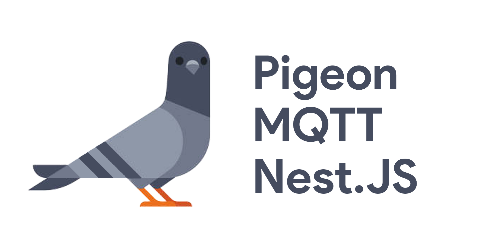

<p align="center">
    
</p>

[circleci-image]: https://img.shields.io/circleci/build/github/nestjs/nest/master?token=abc123def456

[circleci-url]: https://circleci.com/gh/nestjs/nest

  <p align="center">A MQTT Server Side module for Nest.js</p>

## Description

[Nest](https://github.com/behnamnasehi/nest-mqtt-server) framework TypeScript starter repository.

## Installation

```bash
$ npm install pigeon-mqtt-nestjs
```
 - - - -
## Usage

### First Step :

[Pigeon-Mqtt-Nestjs](https://github.com/behnamnasehi/pigeon-mqtt-nestjs) will register as a global module.
You can import with configuration
```typescript
@Module({
  imports: [
    
    PigeonModule.forRoot({
      port:1884,
      id:"binarybeast",
    })
    
  ],
  controllers: [AppController],
  providers: [AppService],
})
export class AppModule {}
```
## Event: client

- `client` [`<Client>`](./Client.md)

Emitted when the `client` registers itself to server. The `client` is not ready yet. Its [`connecting`](./Client.md##clientconnecting) state equals to `true`.

Server publishes a SYS topic `$SYS/<aedes.id>/new/clients` to inform it registers the client into its registration pool. `client.id` is the payload.

```typescript
@Injectable()
export class TestService {

  constructor(@Inject(PigeonService) private readonly aedesService: PigeonService) {
  }

  @onClient()
  OnNewClient(@Client() client) {
    console.log("Function: @onClient()");
  }
  
}
```
## Event: clientReady

- `client` [`<Client>`](./Client.md)

Emitted when the `client` has received all its offline messages and be initialized. The `client` [`connected`](./Client.md##clientconnected) state equals to `true` and is ready for processing incoming messages.
```typescript
@Injectable()
export class TestService {

  constructor(@Inject(PigeonService) private readonly aedesService: PigeonService) {
  }

  @onClientReady()
  async onClientReady(@Client() client) {
    console.log("Function: @onClientReady()");
  }
  
}
```
## Event: clientDisconnect

- `client` [`<Client>`](./Client.md)

Emitted when a client disconnects.

Server publishes a SYS topic `$SYS/<aedes.id>/disconnect/clients` to inform it deregisters the client. `client.id` is the payload.
```typescript
@Injectable()
export class TestService {

  constructor(@Inject(PigeonService) private readonly aedesService: PigeonService) {
  }

  @onClientDisconnect()
  OnClientDisconnect(@Client() client) {
    console.log("Function: @OnClientDisconnect()");
  }
  
}
```
## Event: clientError

- `client` [`<Client>`](./Client.md)
- `error` `<Error>`

Emitted when an error occurs.
```typescript
@Injectable()
export class TestService {

  constructor(@Inject(PigeonService) private readonly aedesService: PigeonService) {
  }

  @onClientError()
  OnClientError(@Client() client, @Error() error) {
    console.log("Function: @onClientError()");
  }
  
}
```
## Event: connectionError

- `client` [`<Client>`](./Client.md)
- `error` `<Error>`

Emitted when an error occurs. Unlike `clientError` it raises only when `client` is uninitialized.
```typescript
@Injectable()
export class TestService {

  constructor(@Inject(PigeonService) private readonly aedesService: PigeonService) {
  }

  @onConnectionError()
  OnConnectionError(@Client() client, @Error() error) {
    console.log("Function: @OnConnectionError()");
  }
  
}
```
## Event: keepaliveTimeout

- `client` [`<Client>`](./Client.md)

Emitted when timeout happes in the `client` keepalive.
```typescript
@Injectable()
export class TestService {

  constructor(@Inject(PigeonService) private readonly aedesService: PigeonService) {
  }

  @onKeepLiveTimeout()
  onKeepLiveTimeout(@Client() client) {
    console.log("Function: @onKeepLiveTimeout()");
  }
  
}
```
## Event: publish

- `packet` `<aedes-packet>` & [`PUBLISH`][PUBLISH]
- `client` [`<Client>`](./Client.md) | `null`

Emitted when servers delivers the `packet` to subscribed `client`. If there are no clients subscribed to the `packet` topic, server still publish the `packet` and emit the event. `client` is `null` when `packet` is an internal message like aedes heartbeat message and LWT.

> _Note! `packet` belongs `aedes-packet` type. Some properties belongs to aedes internal, any changes on them will break aedes internal flow._
```typescript
@Injectable()
export class TestService {

  constructor(@Inject(PigeonService) private readonly aedesService: PigeonService) {
  }

  @onPublish()
  OnPublish(@Topic() topic, @Packet() packet, @Payload() payload, @Client() client) {
    console.log("Function: @OnPublish()");
  }
  
}
```
## Event: ack

- `packet` `<object>` [`PUBLISH`][PUBLISH] for QoS 1, [`PUBREL`][PUBREL] for QoS 2
- `client` [`<Client>`](./Client.md)

Emitted an QoS 1 or 2 acknowledgement when the `packet` successfully delivered to the `client`.
```typescript
@Injectable()
export class TestService {

  constructor(@Inject(PigeonService) private readonly aedesService: PigeonService) {
  }


  @onAck()
  onAck(@Client() client, @Packet() packet) {
    console.log("Function: @onAck()");
  }
  
}
```

## Event: subscribe

- `subscriptions` `<object>`
- `client` [`<Client>`](./Client.md)

Emitted when `client` successfully subscribe the `subscriptions` in server.

`subscriptions` is an array of `{ topic: topic, qos: qos }`. The array excludes duplicated topics and includes negated subscriptions where `qos` equals to `128`. See more on [authorizeSubscribe](#handler-authorizesubscribe-client-subscription-callback)

Server publishes a SYS topic `$SYS/<aedes.id>/new/subscribers` to inform a client successfully subscribed to one or more topics. The payload is a JSON that has `clientId` and `subs` props, `subs` equals to `subscriptions` array.
```typescript
@Injectable()
export class TestService {

  constructor(@Inject(PigeonService) private readonly aedesService: PigeonService) {
  }

  @onSubscribe()
  OnSubscribe(@Subscription() subscription, @Client() client) {
    console.log("Function: @OnSubscribe()");
  }
  
}
```
## Event: unsubscribe

- `unsubscriptions` `Array<string>`
- `client` [`<Client>`](./Client.md)

Emitted when `client` successfully unsubscribe the `subscriptions` in server.

`unsubscriptions` are an array of unsubscribed topics.

Server publishes a SYS topic `$SYS/<aedes.id>/new/unsubscribers` to inform a client successfully unsubscribed to one or more topics. The payload is a JSON that has `clientId` and `subs` props, `subs` equals to `unsubscriptions` array.
```typescript
@Injectable()
export class TestService {

  constructor(@Inject(PigeonService) private readonly aedesService: PigeonService) {
  }

  @onUnsubscribe()
  OnUnsubscribe(@Subscription() subscription, @Client() client) {
    console.log("Function: @OnUnsubscribe()");
  }
  
}
```
## Event: connackSent

- `packet` `<object>` [`CONNACK`][CONNACK]
- `client` [`<Client>`](./Client.md)

Emitted when server sends an acknowledge to `client`. Please refer to the MQTT specification for the explanation of returnCode object property in `CONNACK`.
```typescript
@Injectable()
export class TestService {

  constructor(@Inject(PigeonService) private readonly aedesService: PigeonService) {
  }

  @onConnackSent()
  onConnackSent(@Client() client, @Packet() packet) {
    console.log("Function: @onConnackSent()");
  }
  
}
```
## Event: closed

Emitted when server is closed.

```typescript
@Injectable()
export class TestService {

  constructor(@Inject(PigeonService) private readonly aedesService: PigeonService) {
  }

  @onClosed()
  onClosed(@Client() client, @Packet() packet) {
    console.log("Function: @onClosed()");
  }
  
}
```
## Dependencies
* [aedes](https://www.npmjs.com/package/aedes)
* [aedes-server-factory](https://www.npmjs.com/package/aedes-server-factory)
 - - - -
## Stay in touch

- Author Twitter - [@binarybeast](https://twitter.com/binarybeastt)

 - - - -
## License

```text
MIT License

Copyright (c) 2021 behnamnasehi

Permission is hereby granted, free of charge, to any person obtaining a copy
of this software and associated documentation files (the "Software"), to deal
in the Software without restriction, including without limitation the rights
to use, copy, modify, merge, publish, distribute, sublicense, and/or sell
copies of the Software, and to permit persons to whom the Software is
furnished to do so, subject to the following conditions:

The above copyright notice and this permission notice shall be included in all
copies or substantial portions of the Software.

THE SOFTWARE IS PROVIDED "AS IS", WITHOUT WARRANTY OF ANY KIND, EXPRESS OR
IMPLIED, INCLUDING BUT NOT LIMITED TO THE WARRANTIES OF MERCHANTABILITY,
FITNESS FOR A PARTICULAR PURPOSE AND NONINFRINGEMENT. IN NO EVENT SHALL THE
AUTHORS OR COPYRIGHT HOLDERS BE LIABLE FOR ANY CLAIM, DAMAGES OR OTHER
LIABILITY, WHETHER IN AN ACTION OF CONTRACT, TORT OR OTHERWISE, ARISING FROM,
OUT OF OR IN CONNECTION WITH THE SOFTWARE OR THE USE OR OTHER DEALINGS IN THE
SOFTWARE.
```
